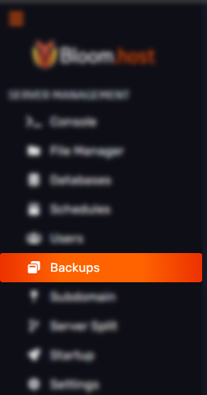
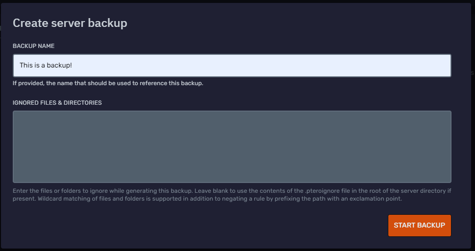
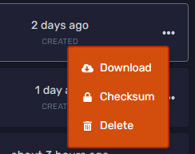
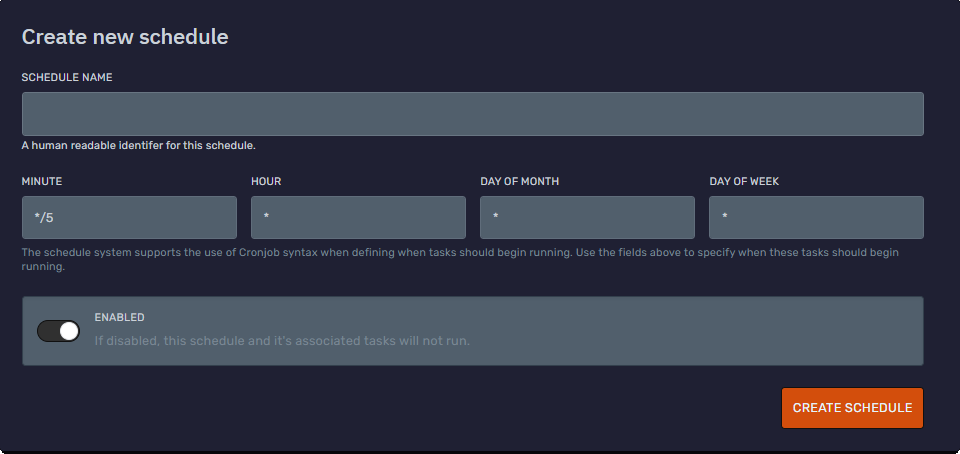
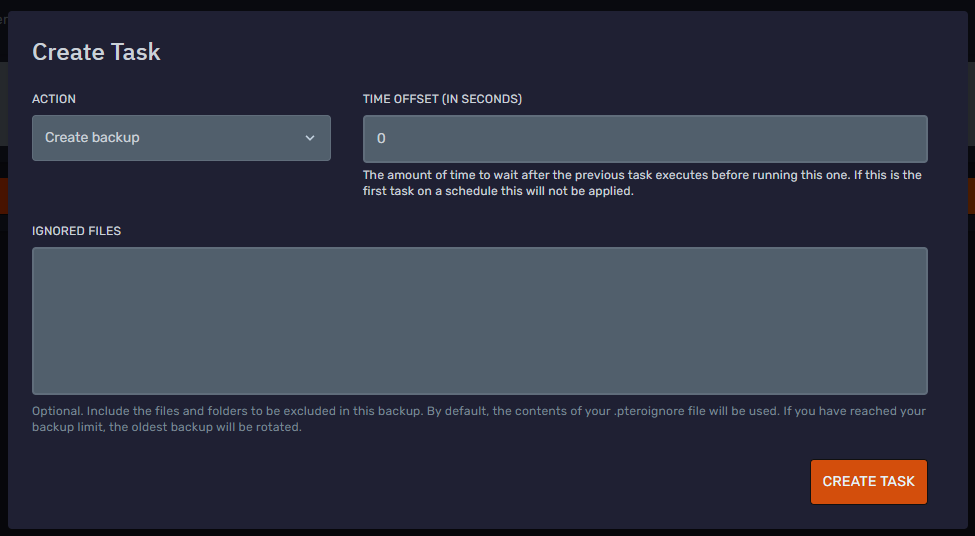
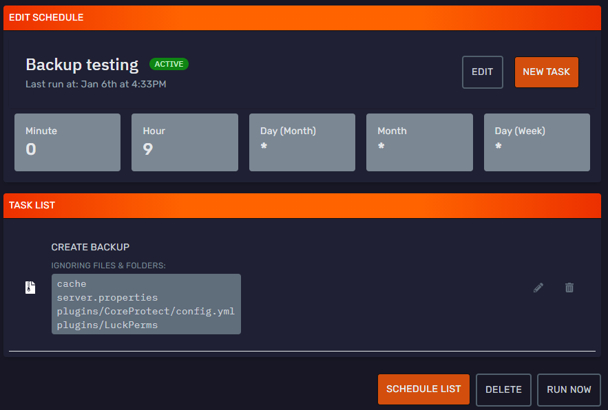

# Creating Backups
Hey there Bloomers! 👋

In this guide, we will go over how create backups in the panel.  
We will go over automating these backups.  
And we will show you how to exclude files and folders from these backups.  

## Manual backups
To create a manual backup, head over to the Backups tab on the panel.

Here you will find your current backups, and a **Create Backup** button. When you click the create backup button, you will get this screen:

Here you can give your backup a name and ignore some files/folders if you want (the ignoring will be explained a bit further down).

Press the **Start Backup** button to continue  
The backup will start in the background, this may take some time depending on the size of your server.   
When the backup is finished you can click the three dots to get a few options.

Download will download the file  
Checksum will show you the sha1 checksum of the file, you can use this to double check file integrity after downloading.  
Delete will delete the backup - Watch out though, it will be permanently gone if you do this!

## Automatic backups
It's also possible to automate these backups! You can make a backup at a specific time of day for example.  
To do this, head over to the Schedules tab on the panel.

Here is where all your schedules are located. We are going to add a schedule that starts a backup, but these schedules can do way more! Find some examples at [Scheduling Actions](https://docs.bloom.host/scheduling-actions/). 

For now we are just going to create a backup, but be sure to check out the other schedule options too!  
To make a new schedule, click the **Create New** button. Enter a name for your schedule and enter a valid timing for it.  
Basically, you have to specify which day or which week of which month get triggered and in what hours. You can also specify actions which get triggered every hour and so on. - We would suggest using a [generator](https://crontab.guru/) to make sure you can set the timing of the schedule perfectly.  
Keep in mind all Bloom servers run on Universal Standard Time (UTC), so make sure your schedules reflect that.

Once finished, click create and open it from the list.  
Click 'New Task'  
And set Action to **Create backup*
 

And you're done!  
Your files will now automatically get backed up at the time you specified.

Keep in mind that you can store up to 5 backups at any time with a max of 3 backups within a 24 hour period.  
If you have reached the backup limit, the oldest backup will be rotated.

## Ignoring files and folders
It's also possible to ignore some specific files or folders in your backups!  
Put these exclusions in the Ignored Files box, keep in mind that they are case sensitive!

To exclude a folder or file in the root directory:  
*folder_or_file_name*

To exclude a file or folder in a subfolder:  
*foldername/folder_or_file_name*

### Here are a few examples to help you understand:  
cache  
server.properties  
plugins/CoreProtect/config.yml  
plugins/LuckPerms  

This list will (from top to bottom) exclude the cache folder, the server.properties file, the CoreProtect config file and the whole LuckPerms folder.

It will look something like this when finished, this schedule will make a backup, excluding those items, every day at 9AM UTC.

