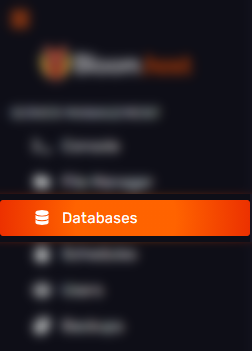
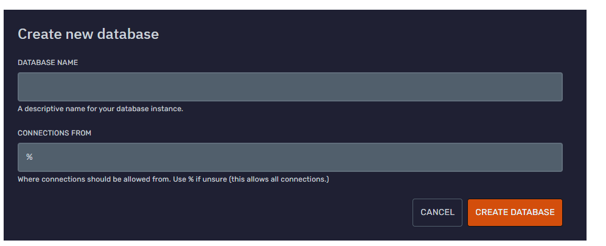

# MySQL Databases

### What is a database?
> "*A database is an organized collection of structured information, or data, typically stored electronically in a computer system.*" - [oracle.com](https://oracle.com)

### Adding MySQL Databases
> 
> First, go to your [game panel](https://mc.bloom.host/) and on the left sidebar, select 'Databases'.
> 

> The red highlighted area is where you can manage any existing databases. Click 'New Database' to create your first!
> 

> 
> In the first box, you assign the database a name. In the box below it, you can restrict MySQL connections. If you don't plan on using it, it's recommended to leave it as % or put it as your server IP. In this tutorial, we will create a database. Pick a name and hit **Create Database**.
> 
> Once you have created the database, it will appear in your list. In order to use it for plugins, simply copy the details it shows into the configuration files for the plugins. Using those credentials, lets give some examples.

---

### Examples
#### ➤ Luckperms:
```YAML
storage-method: MySQL

# The following block defines the settings for remote database storage methods.
#
# - You don't need to touch any of the settings here if you're using a local storage method!
# - The connection detail options are shared between all remote storage types.
data:

  # Define the address and port for the database.
  # - The standard DB engine port is used by default
  #   (MySQL: 3306, PostgreSQL: 5432, MongoDB: 27017)
  # - Specify as "host:port" if differs
  address: 168.119.0.38:3306

  # The name of the database to store LuckPerms data in.
  # - This must be created already. Don't worry about this setting if you're using MongoDB.
  database: s178_test

  # Credentials for the database.
  username: u178_uIxN5UjEZy
  password: '@CSyH7IV8r4TUnaA3A7lu^2T'
```
#### ➤ LiteBans
```YAML
sql:
  # H2, MySQL, MariaDB, and PostgreSQL are supported database drivers.
  driver: MySQL

  ## MySQL/PostgreSQL settings ##
  # If using H2, the database will be stored in the LiteBans plugin folder,
  # and most of these settings won't apply.

  # Database server address.
  address: 168.119.0.38:3306

  # Database name, username and password.
  database: 's178_test'
  username: 'u178_uIxN5UjEZy'
  password: '@CSyH7IV8r4TUnaA3A7lu^2T'
```
#### ➤ CoreProtect
```YAML
use-mysql: true
table-prefix: co_
mysql-host: 168.119.0.38
mysql-port: 3306
mysql-database: s178_test
mysql-username: u178_uIxN5UjEZy
mysql-password: @CSyH7IV8r4TUnaA3A7lu^2T
```
#### ➤ Plan
```YAML
Database:
    Type: MySQL
    MySQL:
        Host: 168.119.0.38
        Port: 3306
        User: u178_uIxN5UjEZy
        Password: @CSyH7IV8r4TUnaA3A7lu^2T
        Database: s178_test
        # Launch options to append after mysql driver address
        Launch_options: "?rewriteBatchedStatements=true&useSSL=false&serverTimezone=UTC"
```
#### ➤ AdvancedBan
```YAML
# If set to false all bans will be saved locally in a HSQLDB-Database
UseMySQL: true

MySQL:
  IP: 168.119.0.38
  DB-Name: s178_test
  Username: u178_uIxN5UjEZy
  Password: @CSyH7IV8r4TUnaA3A7lu^2T
  Port: 3306
  Properties: 'verifyServerCertificate=false&useSSL=false&useUnicode=true&characterEncoding=utf8'
```

### ⚠ Warning:
> Remember to switch out the credentials for what you need!


---