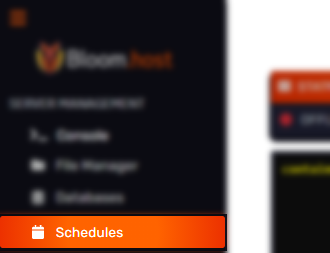

# Horarios

¡Hola Bloomers! En esta guía, repasaremos como usar el horario para preparar acciones en horas determinadas para tu servidor.

Primero, necesitas ir al panel de tu servidor y luego a la barra lateral. Luego, encontrarás una sección llamada Horarios. El número al costado indica cuantas acciones has puesto hasta ahora. 

Aquí es donde todos tus horarios se encuentran en un solo lugar. Para añadir uno nuevo, da click en el botón **Create New**.

En ese panel, hay 3 principales secciones para cada horario que crees. Su nombre, el día y la hora en que será activado, y la acción que hace.

El nombre puede ser lo que desees. Puede ser “Reinicio Diario”, “¡Dile a Billy que es increíble!”, "BloomVPS es de lo mejor!” o "Eres Increíble!”.

La segunda sección es cuando será activado. Ten en cuenta que todos los servidores de Bloom corren en la zona horaria de Universal Standard Time (UTC), así que asegúrate de hacer el cálculo con la tuya. 
El día en el cuál se activará puede ser un día del mes un el día de la semana. De modo que, si quieres que se active cada Sábado, das click en Saturday (Sábado en inglés). Si quieres que se active dos veces al més, puedes escoger el primero y el 15 del mes. Adicionalmente, puedes añadir un comodín, el cual es *. Esto significa que lo hará todos los días, útil para algo como reinicios diarios.

La última sección consiste en lo que va a realizar, si bien un comando o una acción de poder. Los comandos deberían ponerse sin la “/”, y no acepta variables. Puedes usar una acción de poder, por ejemplo, apagar el servidor. Si usas “stop”, el servidor se va a apagar.
Las acciones de poder disponibles son:

- **Start** - Inicia el servidor
- **Stop** - Apaga el servidor
- **Restart** - Apaga y luego inicia el servidor
- **Kill** - Termina el servidor (¡No recomendado!)

## Ejemplos

“Reinicio Diario”

“¡Día de Lanzamiento!”

“LoJoSho debe terminar algo”

